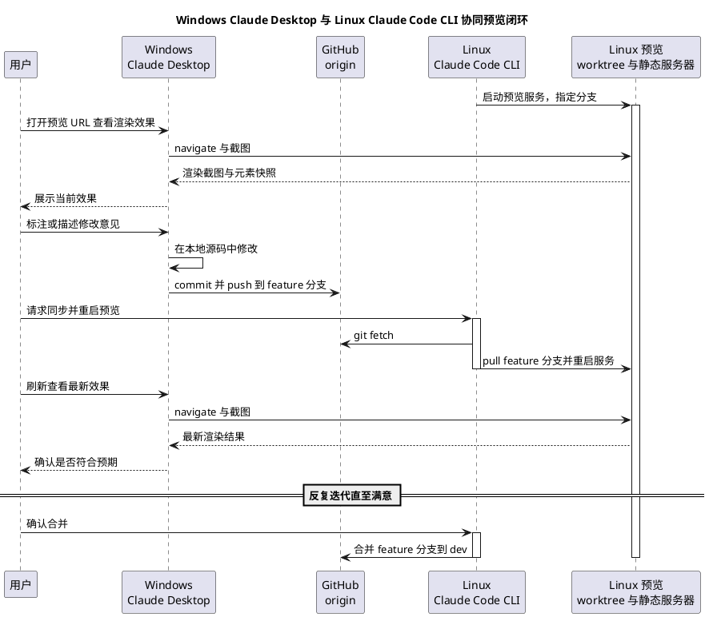

# 跨机协同开发预览工作流

状态：active
最近更新：2026-07-05
适用范围：Windows Claude Desktop 与 Linux Claude Code CLI 之间的本地开发预览闭环。**不决定生产部署目标**——GitHub Pages / Cloudflare Pages / Vercel / 自托管仍是 [待决策问题](open-decisions.md) 中的未决项，本工作流只覆盖“改代码 → 本地渲染验证 → 再改”的迭代环节。

## 背景与目标

个人开发习惯是：视觉审查和标注在 Windows 上用 Claude Desktop 完成（大屏、桌面端体验更好），实际代码编写和网站进程托管放在这台 Linux 开发机上（也就是当前 Claude Code CLI 所在环境）。需要把这两端用 git 串起来，形成一个可重复的“改动 → 预览 → 反馈 → 再改动”闭环，且改动可能来自任意一端。

## 工程量判断

判定为**刚刚好**，理由：

- 不引入任何新依赖或框架：复用项目已有的 `python3 -m http.server`、已存在的 GitHub 远程仓库、Linux 上已经可用的 Playwright MCP 工具链。
- 不新建常驻服务：同步与重启都是按需触发的一次性脚本，不需要 systemd/守护进程，出问题时排查成本低（用户已确认选择“按需触发”而非自动轮询）。
- 不新建标注工具：优先复用 Claude Desktop 自身能力，只有在验证后确认不可行时才退回 Playwright MCP 的元素定位 + 文字描述，不为“标注”单独造一套本地服务或数据库。
- worktree 只新增一个，职责单一（专门给预览用），不做多层嵌套 worktree 或分支矩阵，避免管理成本超过收益。

## 角色与环境

| 角色 | 位置 | 职责 |
|---|---|---|
| Linux 开发机（当前环境） | 本机，Claude Code CLI 所在环境，局域网地址 `192.168.0.162` | 实际代码编辑、托管预览用的静态服务器、执行同步与重启脚本 |
| Windows Claude Desktop | 同一局域网内的 Windows 机器 | 打开预览 URL 查看渲染效果、接收用户标注意见、（视验证结果）直接编辑本地源码并 push |
| GitHub origin | `https://github.com/lyty1997/AxialMuseWebsite.git` | 两端共同的远程仓库，承担双向同步，无需额外中转 |

## 网络与访问

- 已确认 Windows 与本机在同一局域网，可直接用局域网 IP 访问，无需 SSH 隧道或 VPN。
- 本机 `hostname -I` 有两个地址（`192.168.0.108` / `192.168.0.162`），已确认使用 `192.168.0.162`。
- 端口：本机 `8000` 端口已被其他项目占用，本工作流的预览服务固定用 **`8088`**，与 [CLAUDE.md](../../CLAUDE.md) 里给临时手动预览用的 `python3 -m http.server -d public 8000` 是两回事，互不冲突。预览 URL 固定为 `http://192.168.0.162:8088/`。

## 渲染与标注机制（含一项需现场验证的假设）

用户判断 Claude Desktop 应该自带“打开外部 URL 实时渲染”和“在渲染内容上标注”的能力。这一判断需要在真正落地时用一次实测确认，而不是直接假定成立——原因是：

- Claude Desktop 的“Artifact”预览目前渲染的是模型自己生成、托管在沙箱内的 HTML/React 内容，而不是任意外部局域网 URL；这两者是否共用同一套“可标注”交互，取决于具体版本，我这边无法在 Linux CLI 会话里替 Windows 端确认。
- 如果实测发现原生方式确实能直接 navigate 到 `http://192.168.0.162:8088/` 并支持点选标注，那么后续步骤全部不变，只是不需要配置 Playwright MCP 这一节。

### 验证步骤（落地时第一件事）

1. 在 Windows 上打开 Claude Desktop，尝试让它访问 `http://192.168.0.162:8088/`。
2. 确认它能否实际渲染出页面内容（而不是只返回文字描述或报错）。
3. 确认能否在渲染结果上做“点选某个元素 + 写评论”式的标注，并让 Claude Desktop 读到这条标注。
4. 把验证结果（能 / 不能，用的是什么功能名称）补充到本文件“落地步骤”一节。

### 回退方案：Playwright MCP

若第 2 步或第 3 步验证不通过，改用 Playwright MCP（与本 Linux CLI 会话里已经可用的 `mcp__playwright__*` 工具是同一类东西）：

- 在 Windows 端 Claude Desktop 的 MCP 配置（`claude_desktop_config.json`）里加入：

```json
{
  "mcpServers": {
    "playwright": {
      "command": "npx",
      "args": ["-y", "@playwright/mcp@latest"]
    }
  }
}
```

- 渲染方式退化为：Claude Desktop 用 `browser_navigate` 打开预览 URL，用 `browser_take_screenshot` 或 `browser_snapshot` 获取截图或带 `ref` 编号的无障碍树。
- 标注方式退化为：不额外开发标注浮层，用户直接用文字描述问题（可引用 `browser_snapshot` 给出的元素 `ref` 编号做精确定位，例如“ref e13 的按钮字号太小”）。

## 分支与 worktree 布局

沿用全局 git 工作流约定（`main` 稳定 / `dev` 开发主干 / `feature/描述` 特性分支），并新增一个专用于预览的 worktree，理由是：Linux 端可能同时存在“CLI 自己在 `dev` 上直接改动”和“Windows 端某个 `feature` 分支需要马上预览”两件事，两者不应该共用同一个工作目录互相打扰。

```
AxialMuseWebsite/                  # 当前目录，Linux CLI 日常开发用，跟随 dev
AxialMuseWebsite.preview/          # 新增 worktree，专门用于 checkout 待验收分支并跑静态服务器
```

- Linux 主目录（当前工作区）：Claude Code CLI 日常直接改动使用，正常提交到 `dev` 或临时 `feature/*` 分支。
- Linux 预览 worktree（`../AxialMuseWebsite.preview`）：只跑静态服务器，不在这里直接改代码，谁的分支要看效果就切过去看，和主目录互不干扰。
- Windows 端：clone 同一个仓库（`https://github.com/lyty1997/AxialMuseWebsite.git`），日常在 `feature/描述` 分支下编辑，不直接改 `dev` / `main`，改完 push 该分支。

**创建方式的一处约束**：git 不允许同一个分支在两个 worktree 里同时被检出（比如主目录已经在 `dev`，预览 worktree 就不能再 `git checkout dev`，会报 `already used by worktree`）。所以预览 worktree 用 `git worktree add --detach ../AxialMuseWebsite.preview dev` 建成**分离头指针（detached HEAD）**模式，之后每次要看哪个分支的效果，都是 `git checkout --detach <分支或 origin/分支的最新提交>`，而不是切到分支本身。这样无论主目录当前停在哪个分支，预览 worktree 都不会和它冲突，包括预览 `dev` 或 `main` 自己的场景。

## 源码同步脚本（双向、一键）

两端共用同一个 GitHub 远程，“双向同步”不需要额外的中转服务，一个薄的 shell / PowerShell 脚本封装 `fetch + pull --rebase + push` 即可：

- `scripts/dev/sync.sh`（Linux / macOS / Git Bash 通用）：给当前分支执行 `git fetch`，`git pull --rebase`，若有本地未推送的提交则 `git push`。
- `scripts/dev/sync.ps1`（Windows PowerShell）：同样的逻辑，供 Windows 端 Claude Desktop 或用户直接运行。
- 两个脚本都提交进仓库，随 git 同步分发到两端，不需要分别维护。

## 预览服务脚本（按需触发，不常驻）

- `scripts/dev/preview.sh`（只在 Linux 端用）：操作对象是 `../AxialMuseWebsite.preview` 这个 worktree，支持三个子命令：
  - `preview.sh serve <分支>`：如果 worktree 不存在则用 `--detach` 创建，`git fetch` 后 `git checkout --detach origin/<分支>`（分离头指针，原因见上一节），在后台启动 `python3 -m http.server -d public 8088`，PID 写入 `.preview.pid`。
  - `preview.sh restart [分支]`：`git fetch` + `git checkout --detach origin/<分支>`（不传分支则重新拉取并检出当前预览的那个分支的最新提交），杀掉旧进程再重新启动，全程按 PID 文件判断进程是否存活，避免重复启动或杀错进程。
  - `preview.sh stop`：按 PID 文件杀进程并清理。
- 因为是按需触发（用户已确认不需要自动轮询 watcher），这个脚本不需要 `trap`/常驻生命周期管理这类复杂度，每次都是一次性前台命令，简单可控。

## 端到端迭代流程



## 落地步骤 Checklist

1. 在 Linux 端创建预览 worktree（分离头指针模式）：`git worktree add --detach ../AxialMuseWebsite.preview dev`。
2. 新增 `scripts/dev/sync.sh`、`scripts/dev/sync.ps1`、`scripts/dev/preview.sh` 三个脚本并赋予可执行权限。
3. Windows 端 clone 仓库，按“渲染与标注机制”一节完成一次现场验证，把结果（原生可行 / 需要 Playwright MCP）回填到本文件。
4. 两端各跑一次 `sync.sh` / `sync.ps1`，确认能互相看到对方的提交，验证“双向同步”真正打通。
5. 走一轮完整迭代验证并留痕：Windows 端改一处文案 → push → Linux 端 `preview.sh restart` → Windows 端刷新看到变化 → 把这轮“输入改动 → 输出效果”的截图或描述记入 [项目进度](../progress.md)。

## 未决事项

- Windows Claude Desktop 是否原生支持“打开外部局域网 URL 实时渲染 + 点选标注”尚未现场验证；若不支持，按本文件“回退方案”切到 Playwright MCP，不影响其余环节。
- 生产环境最终部署目标（GitHub Pages / Cloudflare Pages / Vercel / 自托管）仍未决定，见 [待决策问题](open-decisions.md)；本工作流只覆盖本地预览环节，与生产部署方式无关，二者可以独立演进。

