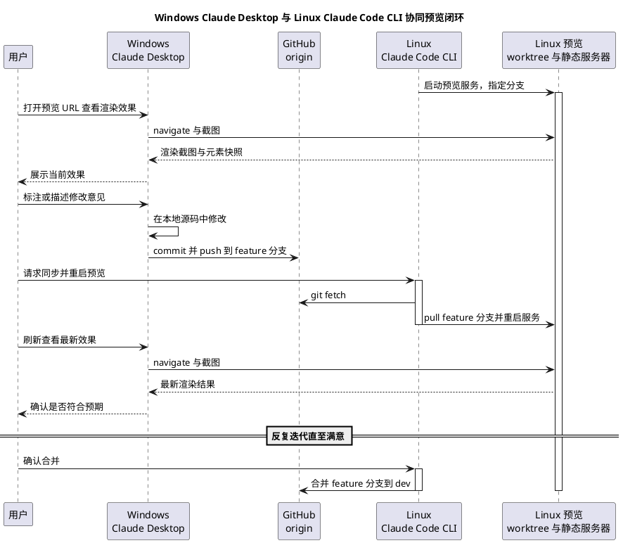

# 跨机协同开发预览工作流

状态：active
最近更新：2026-07-05
适用范围：Windows 机器与 Linux 托管机之间的本地开发预览闭环（编码会话可以在任意一端发起，托管固定在 Linux 一端）。**不决定生产部署目标**——GitHub Pages / Cloudflare Pages / Vercel / 自托管仍是 [待决策问题](open-decisions.md) 中的未决项，本工作流只覆盖“改代码 → 本地渲染验证 → 再改”的迭代环节。

## 背景与目标

个人开发习惯是：视觉审查和标注在 Windows 上用 Claude Desktop 完成（大屏、桌面端体验更好），网站进程托管固定放在一台 Linux 机器上。需要把这两端用 git 串起来，形成一个可重复的“改动 → 预览 → 反馈 → 再改动”闭环，且改动可能来自任意一端。

**一处曾经的误判（2026-07-05 现场验证后更正）**：本文件最初假设“当前 Claude Code CLI 所在环境”等同于“Linux 开发机”，即会话本身固定跑在 Linux 上。实测发现这个假设不成立——Claude Code CLI / Claude Desktop 的编码会话可以运行在 Windows 或 Linux 任意一端（取决于用户在哪台机器上发起对话），与“网站预览服务固定托管在哪台机器”是两回事，不能划等号。本文件后续把两者分开描述：**托管角色**（固定是 `192.168.0.162` 这台 Linux 机器）与**发起编码会话的机器**（可以是 Windows 也可以是 Linux，随时可能变化）。

## 工程量判断

判定为**刚刚好**，理由：

- 不引入任何新依赖或框架：复用项目已有的 `python3 -m http.server`、已存在的 GitHub 远程仓库、Linux 上已经可用的 Playwright MCP 工具链。
- 不新建常驻服务：同步与重启都是按需触发的一次性脚本，不需要 systemd/守护进程，出问题时排查成本低（用户已确认选择“按需触发”而非自动轮询）。
- 不新建标注工具：优先复用 Claude Desktop 自身能力，只有在验证后确认不可行时才退回 Playwright MCP 的元素定位 + 文字描述，不为“标注”单独造一套本地服务或数据库。
- worktree 只新增一个，职责单一（专门给预览用），不做多层嵌套 worktree 或分支矩阵，避免管理成本超过收益。

## 角色与环境

| 角色 | 位置 | 职责 |
|---|---|---|
| Linux 托管机 | hostname `lyty-*`，局域网地址 `192.168.0.162`，用户 `lyty`，仓库实际路径 `~/work/personal_projects/AxiomMind/Axial_Muse/AxialMuseWebsite`（含同级 `AxialMuseWebsite.preview` worktree） | 托管预览用的静态服务器、跑 `preview.sh`；**不是**"Claude Code CLI 固定所在环境"，只是网站进程固定托管在这台机器上 |
| Windows 机器 | hostname `lyty-server`，局域网地址 `192.168.0.163` | 跑 Claude Desktop / Claude Code 编码会话（直接读写本机 git 副本、执行 `sync.ps1`/`restart-remote.ps1`），配对了可控制的 Chrome 浏览器扩展用于渲染验证 |
| GitHub origin | `https://github.com/lyty1997/AxialMuseWebsite.git` | 两端共同的远程仓库，承担双向同步，无需额外中转 |

编码会话本身可能运行在 Windows 也可能运行在 Linux 托管机上（两边都能跑 Claude Code），这不影响本工作流——不管从哪一端发起改动，最终都通过 git 走到 Linux 托管机上重启预览。

## 网络与访问

- 已确认 Windows（`192.168.0.163`）与 Linux 托管机（`192.168.0.162`）在同一局域网，可直接用局域网 IP 访问，无需 SSH 隧道或 VPN；两者之间的 ICMP 与 SSH（22 端口）均已验证连通。
- 端口：Linux 托管机 `8000` 端口已被其他项目占用，本工作流的预览服务固定用 **`8088`**，与 [CLAUDE.md](../../CLAUDE.md) 里给临时手动预览用的 `python3 -m http.server -d public 8000` 是两回事，互不冲突。预览 URL 固定为 `http://192.168.0.162:8088/`。
- **曾经的网络问题（已解决，2026-07-05）**：`preview.sh` 启动的进程监听 `0.0.0.0:8088`，但一开始从 Windows（`192.168.0.163`）对 `192.168.0.162:8088` 发起 TCP 连接会超时/被拒，而 ICMP 和 SSH（22 端口）都通；已排除 Windows 侧出站防火墙。根因确认是 Linux 托管机的主机防火墙只放行了 22 端口，用户在 Linux 端放行 8088（局域网网段）后 `Test-NetConnection` 验证通过，渲染验证也已跟着走通，见 [项目进度](../progress.md)。

## 渲染与标注机制（已现场验证）

**结论：不需要 Playwright MCP，Claude Desktop 自带的 Chrome 扩展配对机制就能用。**2026-07-05 在 Windows 端实测确认：

- Windows 本机的 `claude_desktop_config.json` 里已经有一个配对好的 Chrome 浏览器扩展（`chromeExtension.pairedDeviceName`，且 `allowAllBrowserActions: true`）。这不是 Claude Desktop 的“Artifact”沙箱预览（那个确实只能渲染模型自己生成、托管在沙箱内的内容），而是一个独立的、能真正控制用户本机浏览器的扩展桥接。
- 实测调用桥接的 `list_connected_browsers` 确认连接是活的（`isLocal: true`），并成功用 `navigate` 把浏览器导航到 `http://192.168.0.162:8088/`——渲染发生在一个真实的、用户桌面上可见的 Chrome 窗口里（不是 Desktop 自身面板内嵌，如果需要严格“Desktop 窗口内渲染”而非“Desktop 桌面上的独立 Chrome 窗口”，这一点需要用户确认是否可接受）。
- 标注方式：这套机制不提供“点选元素 + 写贴纸评论”式的可视化标注 UI。实际标注仍然是**对话式**的——用户看着渲染结果，用文字描述想要的修改；需要精确定位时，可以让 Claude 读取页面（accessibility 快照 / `get_page_text` / 截图）拿到元素引用后再描述，而不是指望一个独立的标注浮层或数据库。这与本文件最初设想的 Playwright MCP 回退方案在“标注”这一步是同一种模式，只是渲染桥接换成了官方自带的扩展。

### 备用方案：Playwright MCP

如果换一台 Windows 机器时发现 Chrome 扩展没有配对（`list_connected_browsers` 返回空），才需要退回 Playwright MCP：

- 在 Windows 端 Claude Desktop 的 MCP 配置（`claude_desktop_config.json`）里加入：

```json
{
  "mcpServers": {
    "playwright": {
      "command": "npx",
      "args": ["-y", "@playwright/mcp@latest"]
    }
  }
}
```

- 渲染方式退化为：用 `browser_navigate` 打开预览 URL，用 `browser_take_screenshot` 或 `browser_snapshot` 获取截图或带 `ref` 编号的无障碍树。
- 标注方式与上面一致：文字描述 + 引用元素 `ref` 编号精确定位。

## 分支与 worktree 布局

沿用全局 git 工作流约定（`main` 稳定 / `dev` 开发主干 / `feature/描述` 特性分支），并新增一个专用于预览的 worktree，理由是：Linux 端可能同时存在“CLI 自己在 `dev` 上直接改动”和“Windows 端某个 `feature` 分支需要马上预览”两件事，两者不应该共用同一个工作目录互相打扰。

```
AxialMuseWebsite/                  # 当前目录，Linux CLI 日常开发用，跟随 dev
AxialMuseWebsite.preview/          # 新增 worktree，专门用于 checkout 待验收分支并跑静态服务器
```

- Linux 主目录（实际路径 `~/work/personal_projects/AxiomMind/Axial_Muse/AxialMuseWebsite`）：日常直接改动使用，正常提交到 `dev` 或临时 `feature/*` 分支。
- Linux 预览 worktree（同级 `AxialMuseWebsite.preview`）：只跑静态服务器，不在这里直接改代码，谁的分支要看效果就切过去看，和主目录互不干扰。2026-07-05 已现场确认这个 worktree 真实存在且是分离头指针模式。
- Windows 端：clone 同一个仓库（`https://github.com/lyty1997/AxialMuseWebsite.git`），日常在 `feature/描述` 分支下编辑，不直接改 `dev` / `main`，改完 push 该分支。

**创建方式的一处约束**：git 不允许同一个分支在两个 worktree 里同时被检出（比如主目录已经在 `dev`，预览 worktree 就不能再 `git checkout dev`，会报 `already used by worktree`）。所以预览 worktree 用 `git worktree add --detach ../AxialMuseWebsite.preview dev` 建成**分离头指针（detached HEAD）**模式，之后每次要看哪个分支的效果，都是 `git checkout --detach <分支或 origin/分支的最新提交>`，而不是切到分支本身。这样无论主目录当前停在哪个分支，预览 worktree 都不会和它冲突，包括预览 `dev` 或 `main` 自己的场景。

**Windows 端的 worktree 是另外一回事，工具链自带，不用手动管理**：如果 Windows 端用 Claude Code / Claude Desktop 的编码会话来改代码，工具链本身会给每个会话自动建一个独立 worktree + 分支（例如 `.claude/worktrees/<会话名>`，分支名形如 `claude/<会话名>`），和主目录（跟随 `main`）互不干扰。这天然满足"发生改动时用 worktree 隔离"的诉求，不需要在这份设计里再手动搭一套 Windows 侧 worktree 管理机制；该会话分支后续照常走 push → 同步 → （按需）合并的路径回到 `dev`/`main`。

## 源码同步脚本（双向、一键）

两端共用同一个 GitHub 远程，“双向同步”不需要额外的中转服务，一个薄的 shell / PowerShell 脚本封装 `fetch + pull --rebase + push` 即可：

- `scripts/dev/sync.sh`（Linux / macOS / Git Bash 通用）：给当前分支执行 `git fetch`，`git pull --rebase`，若有本地未推送的提交则 `git push`。
- `scripts/dev/sync.ps1`（Windows PowerShell）：同样的逻辑，供 Windows 端 Claude Desktop 或用户直接运行。额外支持一个可选开关 `-RestartPreview`（默认不开，不影响与 `sync.sh` 的对等行为）：推送成功后顺带调用 `restart-remote.ps1` 通过 SSH 让 Linux 端预览重启，把"改代码→同步→重启→查看"收成一条命令。
- 两个脚本都提交进仓库，随 git 同步分发到两端，不需要分别维护。
- **踩过的坑**：`.ps1` 文件里带中文注释时必须存成**带 BOM 的 UTF-8**。Windows PowerShell 5.1 解析 `.ps1` 源码时，没有 BOM 就按系统 ANSI 代码页（这台机器是 GB2312）解码，会把 UTF-8 的中文字节序列读成乱码，进而在字符串/括号处报一堆看似无关的语法错误。判断依据：这类报错只在直接执行 `.ps1` 文件时出现，`Read`/`cat` 出来的内容看着完全正常。修法是用 `[System.Text.UTF8Encoding]::new($true)` 之类方式重新写盘，确保开头是 `EF BB BF`。

## 预览服务脚本（按需触发，不常驻）

- `scripts/dev/preview.sh`（只在 Linux 端用）：操作对象是 `../AxialMuseWebsite.preview` 这个 worktree，支持三个子命令：
  - `preview.sh serve <分支>`：如果 worktree 不存在则用 `--detach` 创建，`git fetch` 后 `git checkout --detach origin/<分支>`（分离头指针，原因见上一节），在后台启动 `python3 -m http.server -d public 8088`，PID 写入 `.preview.pid`。
  - `preview.sh restart [分支]`：`git fetch` + `git checkout --detach origin/<分支>`（不传分支则重新拉取并检出当前预览的那个分支的最新提交），杀掉旧进程再重新启动，全程按 PID 文件判断进程是否存活，避免重复启动或杀错进程。
  - `preview.sh stop`：按 PID 文件杀进程并清理。
- 因为是按需触发（用户已确认不需要自动轮询 watcher），这个脚本不需要 `trap`/常驻生命周期管理这类复杂度，每次都是一次性前台命令，简单可控。
- **触发方式有两种，都已验证可用**：
  1. 人工经由 Linux 端会话执行（原始设计）：不管是 Claude Code 会话还是用户自己登录，只要在 Linux 托管机上直接跑 `preview.sh restart` 即可。
  2. Windows 端直接 SSH 触发（新增，见下一节"远程重启"）：不需要额外开一个 Linux 端会话，`restart-remote.ps1` 会通过 SSH 在 Linux 托管机上执行同一个 `preview.sh restart`，两种方式最终跑的是同一段远端逻辑，只是发起点不同。

## 远程重启（Windows → Linux，通过 SSH）

为了让"改源码→同步→重启→查看"能在 Windows 一端一次性发起、不必再手动切到 Linux 端会话，新增：

- `scripts/dev/restart-remote.ps1`（只在 Windows 端用）：SSH 到 Linux 托管机，`cd` 到仓库实际路径后执行 `./scripts/dev/preview.sh restart <分支>`。不重新实现远端逻辑，只是把"喊它跑一次"这一步从 Windows 补上。默认分支取本地当前分支，也可用 `-Branch` 显式指定。
- 依赖：Windows 到 `192.168.0.162`（用户 `lyty`）的免密 SSH 登录，用一把**专用**密钥（`~/.ssh/id_ed25519_axialmuse_preview`，不复用 GitHub 那把），在 `~/.ssh/config` 里通过 `Host 192.168.0.162` + `IdentityFile` + `IdentitiesOnly yes` 绑定，公钥需要用户手动追加到 Linux 端 `~/.ssh/authorized_keys`（这一步涉及修改远端机器的访问控制，Claude 不代为操作，只生成密钥对和使用说明）。
- `sync.ps1 -RestartPreview` 会在推送成功后自动调用这个脚本，实现单条命令收尾。

## 端到端迭代流程



**已验证的捷径**：图中"User → Linux：请求同步并重启预览"这一步，如果 Windows 端就是发起改动的一方，不必真的去找一个 Linux 端会话——直接在 Windows 上跑 `sync.ps1 -RestartPreview` 即可，它会在推送成功后自己通过 SSH 触发 Linux 端的 `preview.sh restart`，等价于图中 `Win → Hub`、`User → Linux`、`Linux → Hub`、`Linux → Preview` 这几步揉在一起，少一次人工切换。

## 落地步骤 Checklist

1. ~~在 Linux 端创建预览 worktree（分离头指针模式）~~：**已完成**，`../AxialMuseWebsite.preview` 已现场确认存在。
2. ~~新增 `scripts/dev/sync.sh`、`scripts/dev/sync.ps1`、`scripts/dev/preview.sh` 三个脚本并赋予可执行权限~~：**已完成**（`ee7b400`），Linux 端两个 `.sh` 已确认带可执行位。
3. ~~Windows 端 clone 仓库，按"渲染与标注机制"一节完成一次现场验证~~：**已完成，2026-07-05**——配对的 Chrome 扩展可用，见"渲染与标注机制"一节，不需要 Playwright MCP。
4. ~~两端各跑一次 `sync.sh` / `sync.ps1`，确认能互相看到对方的提交~~：**已完成**（此前验证时把 `dev` 推到了 origin，见 [项目进度](../progress.md)）。
5. **新增并已验证**：Windows 端生成专用 SSH 密钥、用户手动装到 Linux 端 `authorized_keys`、`restart-remote.ps1` 通过 SSH 成功触发 Linux 端 `preview.sh restart`（从 `779407e` 拉到 `ee7b400` 并重启）。
6. ~~走一轮完整"改动 → 推送 → 远程重启 → Windows 端渲染确认"的端到端验证~~：**已完成，2026-07-05**。Linux 托管机放行局域网到 8088 端口的访问后，`Test-NetConnection` 从 Windows 端确认端口可达；用已配对的 Chrome 扩展 `navigate` 到 `http://192.168.0.162:8088/`，标签页标题变为真实的 `Axial Muse`、正文内容读取正常，确认渲染链路完全打通。详细记录见 [项目进度](../progress.md)。

## 未决事项

- 生产环境最终部署目标（GitHub Pages / Cloudflare Pages / Vercel / 自托管）仍未决定，见 [待决策问题](open-decisions.md)；本工作流只覆盖本地预览环节，与生产部署方式无关，二者可以独立演进。

