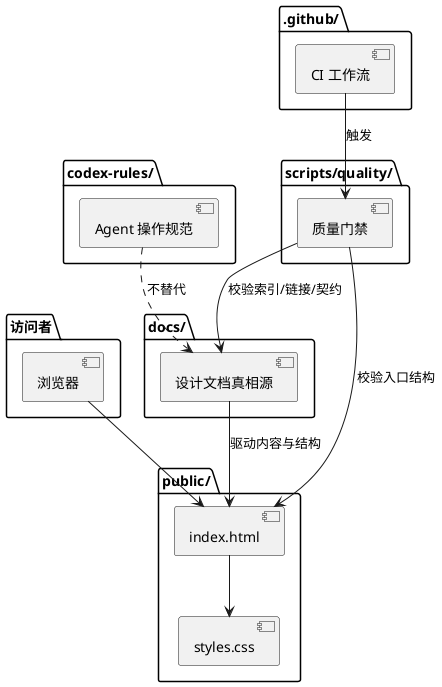

# 架构概览

状态：active  
最近更新：2026-07-09  
适用范围：M0 静态网站与工程规范

## 目标

AxialMuseWebsite 的首版目标是建立一个可维护的个人技术分享网站，并提前保留向产品服务、技术文章和讨论入口演进的结构空间。

## 当前实现

当前没有运行时后端、数据库、登录、评论系统或用户数据采集。

## 目录职责

- `public/`：首版静态网站入口和资源。
- `docs/`：定位、架构、内容模型、产品服务演进和契约词表的真相源。
- `codex-rules/`：Codex 执行任务时的操作规范。
- `scripts/quality/`：CI 和本地质量门禁。
- `.github/`：PR 模板、CODEOWNERS 和 CI。

## 演进原则

- 引入框架前先明确框架解决的问题，例如内容规模、路由、构建、SEO、MDX、搜索或部署需求。
- 引入用户交互前先明确隐私边界、滥用风险、数据保留和删除策略。
- 产品服务上线前先明确服务边界，不用营销文案替代真实能力说明。

