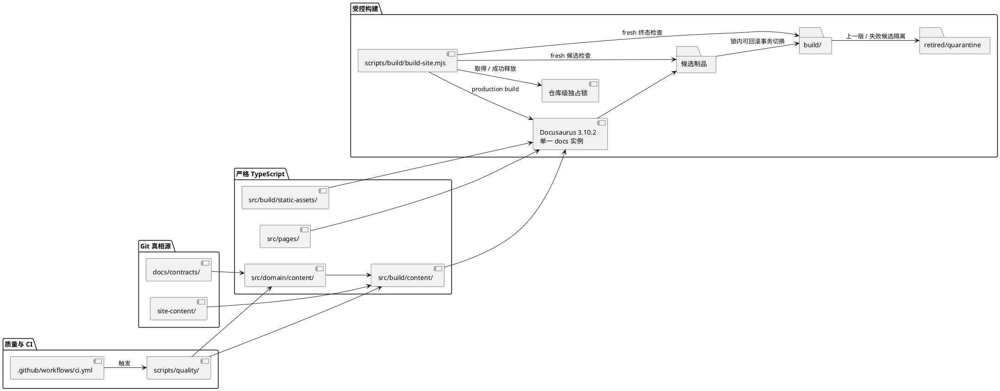
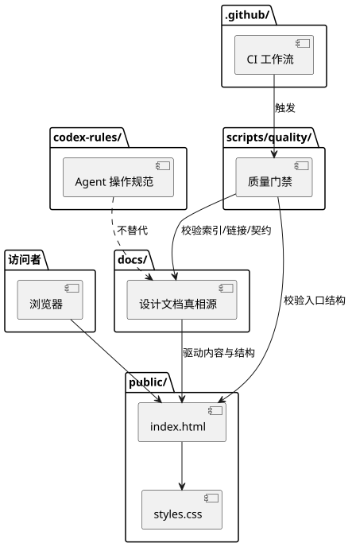
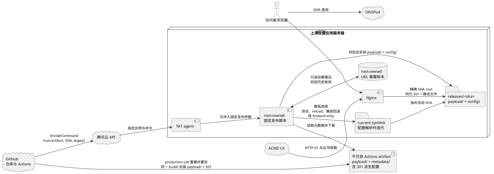
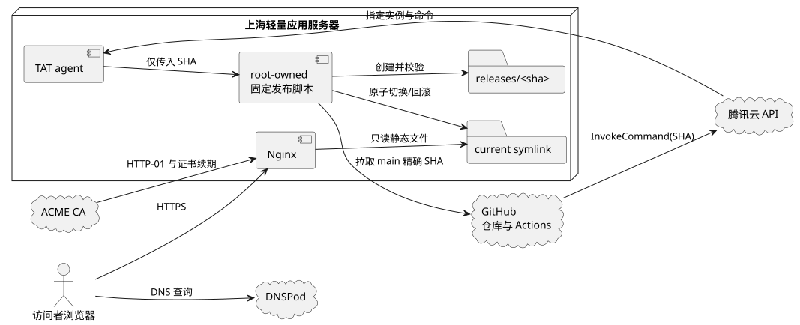

# 架构概览

状态：active  
最近更新：2026-07-29
适用范围：M0 静态网站、工程规范与生产发布基线

## 目标架构更新

用户已确认主站使用 Git + Docusaurus 静态构建，并采用“静态主站 + 中央身份服务 + 独立评论服务 + 各项目独立服务”的演进方向。D-053 至 D-077 已固定单一 docs 内容实例、领域内容单一真相源、Docusaurus `3.10.2`、Node 24、严格 TypeScript、npm 冻结安装、目标源码边界和首次供应链准入协议。D-078 进一步把不改变产品方向、数据边界或基础设施授权的 M0 内部工程与展示细节委托给 Agent 查证、落盘并验证，D-079 增加 Node 24 测试类型直接候选；E-001 至 E-016 已固定项目结构化事实与长文职责拆分、URL 与路由闭包、内容注册表、classic/Infima 最小主题适配、静态制品交付、项目主预览 schema、发布态素材白名单、可验收草稿预览、npm 启动前隔离、确定性 SPDX、Node ESM TypeScript 测试、Docusaurus 官方结构化 frontmatter 解码、HEAD 可达完整 Git 历史门禁、同版本服务端 301、production artifact 自包含字节闭包，以及单一内容装配与零公开文档适配。D-097 至 D-103 已完成 Node 24 可信 CI 第一阶段、#12 历史门禁、#32 workflow 契约、静态白名单路径泄漏修复、零依赖 pre-commit 修复、普通 CI 移除 live audit 及 #24 作者创建事务；这些集成事项仍须以精确组合 SHA 完成远端 CI 与 `dev -> main` PR 验收。#13 已完成仓库侧 301 派生与真实 Nginx Docker 验收；#33 的确定性 release 封装、规范摘要和独立复验已由 `b38354b` 推送到专题分支，但该 ref 不触发现有 CI；#35 的服务器独立 verifier 与共享 golden 已完成本地实现。#14 的 artifact producer/upload workflow、#36 的目标服务器清单与 verifier 安装验收，以及 #37 的不可变安装、账本和激活继续独立推进。完整约束见[主站目标架构](main-site-target-architecture.md)和[待决策问题](open-decisions.md)。

本文其余部分记录当前仓库实现和 2026-07-13 形成的 M0 生产基线。凡涉及手工维护 `public/index.html`、零框架或推迟静态站点生成器的内容，均已被 D-028、D-029、D-051 先后替代；在 Docusaurus 迁移完成前，它们只描述当前状态，不代表目标实现。

## 目标

AxialMuseWebsite 的首版目标是建立一个可维护的个人技术分享网站，为每个可体验项目提供独立子域名入口，并提前保留向产品服务、技术文章和讨论入口演进的结构空间。

## 架构决策摘要

| 决策域 | M0 选择 | 设计依据 |
|---|---|---|
| 页面技术 | 当前公开交付仍是手写静态骨架；仓库已建立 Node 24 LTS + 严格 TypeScript + Docusaurus `3.10.2`，#26 已远端闭环唯一 `site-content/` docs 实例、内容投影和 production 候选制品验收，#27 已远端闭环页面与公开表达并完成关闭后审查补验，#28 已远端闭环主题、响应式与可访问性验收 | classic/Infima 最小适配；首页与列表页使用严格 TypeScript 页面，项目与文章详情由 docs 实例承载；项目/文章双侧栏遵守 E-004 的三档响应式契约，不引入 UI 库、搜索或文章专属交互 |
| 内容事实 | Git 审核；`projects.json` 拥有项目结构化事实与主预览引用，`site-content/projects/` 拥有项目长文，`site-content/writing/` 拥有技术文章 | E-001/E-003/E-006/E-007 固定叙事所有者、作者、主题、项目模块与主预览 schema；构建期只读投影框架字段，构建产物不成为编辑源 |
| URL 与发现 | 根 `routeBasePath`，文章原生完整 `slug`，项目短 slug；canonical 统一使用末尾 `/` | E-002/E-014 失败关闭检查重复路由、断链、锚点和精确重定向；旧路径及活动无斜杠路径由同一 release 的 Nginx exact rules 返回 301，不生成静态跳转页 |
| 当前质量运行时 | 仓库已固定 `.nvmrc` 精确基线与 `>=24.16.0 <25` 兼容入口；D-080 已让本地 pre-commit 在子进程使用用户级 nvm/Node 24，系统默认 Node 仍为 Node.js 22 ESM；D-097 至 D-102 已完成 Ubuntu CI 主/最低端点、完整历史与零依赖本地质量入口的专题实现 | E-010 隔离 runner、随附 npm 双端点、离线 CLI、本地作者 hook 与 #21 真实图准入已落盘；Node `24.18.0`/npm `11.16.0` 与 Node `24.16.0`/npm `11.13.0` 已对同一 lock 完成隔离冻结安装和专题本地验收，现依 D-104 纳入 `dev`，组合树精确远端运行证据尚待取得 |
| 图表 | 现有 PlantUML 源码编译为静态 SVG | 保留构建期图表流程，不增加浏览器端渲染或 Docusaurus 运行时插件 |
| 质量与供应链 | D-053、D-074、D-077、D-079 固定能力类别、独立 `tsc --noEmit`/Node ESM test/Docusaurus build 和 npm 原生失败关闭准入；D-099 使普通 CI 只执行静态供应链证据，不联网 audit | #9/#10 已实现 E-010/E-011；#21 已完成 1,225 个 canonical identity 的真实 tarball 审查与准入、正式 SBOM/evidence/NOTICE、首次准入当时的 audit 全零、D-082 最终决定和双端点 composite receipt；2026-07-26 最新 live audit 的 18 个 high 仍是未修复风险。#22/#11/#26 已接通 typecheck、测试与真实 production build，D-097 至 D-102 已实现 Node 24 CI、完整历史、静态供应链和零依赖 pre-commit 门禁；#33 已实现 release 封装与独立复验，#35 已实现不依赖 Node/npm 的服务器侧第二实现。组合树远端 CI、#14 producer/upload、#36 目标机验收和 #37 部署门禁仍待后续阶段 |
| 生产服务 | Ubuntu 24.04 LTS + Nginx + Certbot（ACME HTTP-01）+ systemd/logrotate | 直接提供静态产物和原生运维，不运行主站应用后端或数据库 |
| 发布 | GitHub Actions `production-artifact` 在 prerequisite 成功后对 `main` 精确 SHA fresh rebuild + full quality，将同一 `build/` 与派生 301 配置封装为不可变 `payload/` + `metadata/` artifact -> main HEAD 新鲜度检查 -> CAM -> TAT 固定命令 -> 整版 release | 不跨 job 传递 build；最终 artifact 绑定 repository/run/ID/SHA、外层 `artifactDigest`、artifact 外 `releaseContentSha256`、build tree、payload、运行清单、Nginx 配置与逐文件 SHA-256；服务器安装同 SHA payload/config，不安装 Node、不拉源码、不执行仓库脚本 |
| 数据与隐私 | 无应用数据层、无 Cookie、无第三方运行时请求 | M0 没有已确认的数据收集需求 |

当前有效的选择、取舍和实施门禁见[主站目标架构](main-site-target-architecture.md)。[M0 主站实现 Spec](../product/m0-main-site-spec.md)已按 D-078 与 E-001 至 E-016 收敛为 Docusaurus 多页面实现基线；内部实现细节不再逐项请求用户选择。#9、#10、#21、#22、#11、#23、#5、#6、#7、#26、#27 与 #28 已闭环各自实现和远端验收，#27/#28 已进入 `main@d00000e`；D-097 至 D-103 的双端点 CI、#12 历史门禁、#32 workflow 契约与 #24 作者创建事务已完成专题实现和本地验收，组合后的远端 CI 与对应 Issue 证据仍须以精确 SHA 和 GitHub 实际记录单独验收。#13 已完成仓库侧 301 和本地真实 Nginx 闭环；#33 的仓库侧 release 封装、摘要与独立复验已由 `b38354b` 推送但没有该 ref 的远端 CI；#35 服务器独立 verifier 已完成本地实现。#8、#14、#36、#37 继续跟踪预览、artifact workflow/upload、目标机清单与服务器发布。基础设施、公开事实、数据与未来动态能力仍执行原门禁，后续依赖变化也必须重新准入。

## 当前实现

当前没有运行时后端、数据库、登录、评论系统或用户数据采集。

## 目标生产架构

首版生产环境采用 GitHub + 腾讯云 DNSPod + 腾讯云轻量应用服务器：

| 层级 | 组件 | 职责 |
|---|---|---|
| 源码与审核 | GitHub | Git 历史、PR、分支保护、Actions 质量门禁和 deployment 记录 |
| 本地预览 | 现有 Linux 预览机 | feature / `dev` 分支渲染与桌面/移动验收 |
| 域名解析 | 腾讯云 DNSPod | `axialmuse.com` 权威解析和 DNSSEC |
| 生产执行 | GitHub Actions + 腾讯云 TAT | 对 `main` 精确提交构建不可变 artifact，并以固定参数触发受限的原子发布 |
| Web 服务 | 腾讯云轻量应用服务器 + Nginx | HTTPS、同版本 exact 301、安全头和精确 SHA 静态 Web Root；root-owned 只追加 URL 暴露账本约束历史路径兼容性 |
| 公开站点 | 当前为 `public/` 骨架；目标为从 Docusaurus 默认 `build/` 逐文件复制得到的 artifact `payload/` | 运行清单与 Nginx 配置安装到同 release 非公开 `config/`；请求期只提供 `payload/`，服务器不重建规则 |
| 项目体验 | `<project-slug>.axialmuse.com` | 已登记项目的独立静态体验、证书、发布和回滚边界 |

主站生产发布必须来自 `main` 的精确提交，其他分支只在现有局域网环境预览。项目体验由各自仓库发布到独立子域名，主站只维护入口与注册表。完整子域名边界见 [项目体验子域名架构](project-experience-hosting.md)，服务器、DNS、备案、上线与回滚设计见 [域名与生产发布设计](../operations/domain-deployment.md)，运行责任见 [自动化维护与运行手册](../operations/maintenance.md)。

## 数据与请求流

### 设计到发布

1. 项目结构化事实写入 `docs/contracts/projects.json`，项目长文写入 `site-content/projects/<project-id>/index.md|index.mdx`；技术文章写入 `site-content/writing/<source-name>/index.md|index.mdx`，作者、主题和模块引用分别受 E-003 注册表约束。
2. 实现者在 `dev` 或 feature 分支修改目标 Docusaurus 源码、内容与契约；迁移完成前的 `public/` 只描述当前可见骨架，不参与目标内容双写。
3. 本地与 CI 校验内容模型、路由、链接、资源、Secret、依赖、类型、测试和静态制品。
4. 真实浏览器按 E-004 完成桌面、平板、移动端和键盘验收，证据随 PR 评审。
5. `dev` 集成验证通过后创建 `dev -> main` PR；合入 `main` 后，`website-quality`、`node-minimum`、`diagrams` 和 `supply-chain` 对精确 `GITHUB_SHA` 执行各自发布必需门禁。
6. 四项全部成功后，非 matrix `production-artifact` 在 fresh runner 对同一 SHA 完整 checkout，以全新隔离 cache 冻结安装并重新执行主端点的零依赖 `quality`、独立 E-013 历史入口、`typecheck`、`test` 与 production `build`，生成且重验唯一 production `build/`；不下载或复用 `website-quality` 的 job-local build。
7. 同一 job 紧接着由封装器在临时 `dist/release/` 中把该 `build/` 逐文件复制为 `payload/`，从同一 payload 公开路由和 `redirects.json` 派生 `metadata/runtime-redirects.json`、`metadata/nginx/redirects.conf`，并生成绑定 source build tree、payload 和规则的 `metadata/release.json` 与稳定 `metadata/files.sha256`。独立校验通过后，从 exact release 全文件树计算不写入 artifact 的 `releaseContentSha256`，随即只上传该目录一次，输出唯一 artifact ID、外层 `artifactDigest` 与前述独立摘要。
8. `deploy-production` 先以只读 GitHub 权限复核 canonical `main` 仍等于本次 SHA，并核对当前 run/artifact/head SHA/外层 digest；concurrency 只承担互斥，不替代新鲜度检查。通过后才引用最小权限 CAM 调用固定 TAT command，只传 workflow run/artifact 标识、提交 SHA、`artifactDigest` 和 `releaseContentSha256`；deploy 不按名称、最新版本或跨 run 搜索 artifact。
9. 服务器把下载结果置于私有 staging 后，由 root-owned 安装副本（仓库源为 `ops/deploy/verify_artifact.py`）核对外层 `artifactDigest`，安全解包，并从 exact release 独立重算外传 `releaseContentSha256`，继续核对内部 release/file/route/redirect 摘要、提交 SHA 和精确 Nginx 字节；成功只形成 `verified-release` 和单行结构化结果，不安装、不激活。
10. #37 在部署排他锁内重新核对 verified staging 的身份与整树摘要，再把 payload 与两个可部署派生文件安装到同一 `releases/<sha>/payload/`、`config/`。root-owned 脚本用只追加 URL 暴露账本证明历史 source/target 仍收敛到同一当前 200，再生成只引用该 SHA 的 Nginx 包装；候选的全部规范路由和新增或改指的 registered 边在 reload 前预写，只有通过更新后账本的 fallback 才可自动回滚，否则默认停止或经生产授权进入 forward-only。
11. GitHub runner 完成公网 HTTPS、canonical、单跳 301、目标 200、关键页面与资源冒烟，并保留 deployment 记录。

当前 `public/` 仍是迁移前公开入口，但仓库的 Docusaurus production build、#13 重定向派生、#33 `payload/` + `metadata/` release 封装/复验和 #35 服务器独立 verifier 已经具备。本地生成的 `dist/release/` 不是已上传 Actions artifact，本地 verifier 通过也不是目标服务器验收，二者都不可据此声明生产发布完成；#14 仍须把 CODE-015/CODE-019/CODE-020 入口接入 `production-artifact` 的 fresh build 与单次上传，#36 须固定并核验服务器安装副本和系统运行时，#37 才消费 `verified-release`。生产服务器最终只安装已验证 payload 和非公开运行配置，不解释源注册表、不拉取源码、不运行 Node/npm 或从源码 checkout 执行脚本，也不成为内容编辑或构建源。

### 浏览器请求

1. DNSPod 将 `www.axialmuse.com` 解析到轻量服务器。
2. Nginx 终止 TLS，校验精确 Host，并使用活动配置中包含 40 位 SHA 的绝对 root 和同 SHA redirect include；`current` 只在 reload 解析配置时选择 release，不参与请求期文件查找。
3. 当前骨架加载本地 HTML、CSS 和图片；目标 `build/` 加载 Docusaurus 标准 React 客户端资源和仓库内静态资产。未经批准时，页面不请求站点 API、第三方字体、分析或嵌入脚本。
4. 用户主动点击 GitHub 或备案链接时才离开本站。

### 信任边界

- **公开边界**：当前 `public/` 和未来 Docusaurus 静态制品中的 HTML、CSS、JavaScript、图片、视频、字幕和元数据均可被任何人下载，不能包含秘密或私人资料。
- **仓库边界**：GitHub 保存源码、公开文档、CI 记录和绑定精确 SHA 的不可变 `payload/` + `metadata/` artifact；其中服务端规则是源注册表与同一 payload 的派生结果，GitHub secrets 只进入受控 workflow，不写入 release。
- **云控制面边界**：腾讯云保存 DNS、CAM、TAT、实例和证书运行状态；控制台不是内容真相源。
- **服务器边界**：Nginx 只读同一 artifact release 中的 `payload/` 与非公开 redirect config；发布脚本校验 `metadata/`，只把运行清单/配置复制到非 Web Root `config/`，不拉取源码、重建规则或运行构建。发布脚本和证书由受限系统身份管理，网页内容不能写服务器磁盘。

## 故障隔离

- 页面内容或 CSS 错误只能整版切换通过 URL 暴露账本的兼容 release，不修改 DNS 或重装服务器；历史 source 或 target 在 fallback 中不再收敛到同一 200 时，不得回滚，改走向前恢复。
- Nginx 或证书错误先回滚对应配置，不重新发布页面内容。
- 主站与项目体验使用独立目录、证书和发布命令；一个体验失败不能切换主站 release。
- DocRestore 当前不创建 DNS、Nginx 或证书，因此其私有后端不会进入主站生产故障域。
- GitHub Actions、TAT 或公网检查失败时不得把未验证 release 标记为成功。
- artifact 的提交、外层 `artifactDigest`、artifact 外 `releaseContentSha256`、内部 metadata、payload/运行规则文件清单或归档路径校验失败时不得创建或切换 release。

## 目录职责

- `public/`：迁移前静态网站入口和资源；不是 Docusaurus 目标源码或已确认的目标产物目录。
- `build/`：Docusaurus 默认静态输出；`website-quality` 与 `production-artifact` 分别在自己的 runner 生成，只有后者经过同 job 完整重验的实例是封装器只读输入。它不是 Actions artifact 根、编辑源或 `src/build/`。
- `dist/release/payload/` 与 `dist/release/metadata/`：CODE-015/CODE-019/CODE-020 的临时 artifact 封装；前者逐文件复制 production job 的 `build/`，后者保存 source build tree、release 身份、文件摘要、运行重定向清单和 Nginx 配置。`dist/` 不提交；服务器只公开 payload，并把两个可部署派生文件安装到同 release 的非 Web Root `config/`。
- 根 `docusaurus.config.ts` 与 `sidebars.ts`：D-075 的框架入口由 #22 创建；#26 已远端闭环 E-016 的 classic-derived preset 与唯一 `site-content/` docs 实例，并显式导出只消费已校验投影的 `projectsSidebar` 与 `writingSidebar`。production 零公开正文只跳过固定版本已证实有缺陷的官方 `contentLoaded`；有公开正文时对受控浅投影委托并清空其 `drafts`，防止框架把未发布 ID 写入浏览器数据；不保留 `docs:false`、占位正文或第二内容根。
- `site-content/projects/<project-id>/`：E-001 的项目长文正文；项目结构化事实继续由 `docs/contracts/projects.json` 拥有。
- `site-content/writing/<source-name>/`：D-060 至 D-064 的技术文章源码与文章局部 `assets/`。
- `site-assets/projects/<project-id>/`：E-007 的项目主预览原件；不直接进入 Docusaurus 静态目录，公开路径由注册表字段和受控构建入口派生。
- `static-public/`：E-008 的始终公开品牌与根级静态文件；每个文件由 `docs/contracts/static-public-assets.json` 显式登记角色，禁止项目、文章和待审核素材，并与获准项目预览一起投影到临时白名单树。
- `src/domain/` 与 `src/build/`：领域核心与构建期适配源码；#22 已创建 `src/build/site-config/`，#23 已创建 `src/domain/content/`，#26 已远端闭环路由/侧栏/日期索引纯投影与 `src/build/content/` 的扫描、frontmatter、Docusaurus 和制品适配。`src/build/` 是源码目录，不是静态构建产物目录。
- `src/components/`、`src/pages/` 与 `src/theme/`：通用展示组件、E-004 文件路由页面与最小主题适配；#27 已实现页面、公开表达和安全关系投影，#28 已实现主题、三档响应式、原生折叠和移动导航可访问性，两项均已远端闭环并进入 `main`。
- `scripts/author/`：#24 的显式 Node.js 作者工具目录；直接 Node 入口、UUIDv7、作者/build 双锁、原子 staging/rename、回滚和消费者残留门禁已完成专题分支实现与本地验收，现依 D-104 纳入 `dev`，组合树远端验收仍待精确 SHA 证明。
- `scripts/build/`：#26 已远端闭环 #22 入口的 production 独占构建事务；D-098 又把白名单发布固定为仅服务端 `postBuild` 逐文件复制，并阻断私有绝对路径进入公开文本制品。构建先生成任务私有候选并由独立 Docusaurus 进程验收，锁内可回滚切换到 `build/` 后再以 fresh session 验收终态；上一版或失败候选只能进入固定 retired/quarantine，成功释放锁才是 commit point。preview 的持久候选与激活仍由 #8 接管。
- `scripts/release/`：#13 拥有运行时重定向派生和固定 digest Docker Nginx 验收；#33 的 `package-site.mjs` 与共享 release 核心把已重验 `build/` 确定性封装到私有 `dist/release/`，`scripts/quality/check-release-package.mjs` 从 build、registry 和磁盘 release 独立重建并只输出外部 `releaseContentSha256`。两个真实 CLI 都要求冻结依赖已安装，以复用 production Docusaurus checker；`quality` 中的核心 fixture 仍不要求 `node_modules/`。
- `ops/deploy/`：#35 的服务器侧独立 Python 3.12 标准库 verifier 与 Node/Python 共享 golden vectors；它不依赖 Node/npm，也不进入 Node-only `quality`/pre-commit。仓库路径是安装源，不授权服务器拉取源码；#36 负责 root-owned 安装副本、运行时和权限现场验收。
- `docs/`：定位、架构、内容模型、产品服务演进和契约词表的真相源。
- `docs/contracts/projects.json`：项目结构化事实、导航顺序和项目写作模块的唯一注册表。
- `docs/contracts/authors.json` 与 `docs/contracts/topics.json`：E-003 的作者和主题注册表。
- `docs/contracts/redirects.json`：E-002/E-014 的精确同站永久重定向唯一登记，不接收通配规则；运行清单与 Nginx 配置只能派生，不能反向编辑。
- `/var/lib/axialmuse/url-exposure-ledger.json`（服务器外部运行状态）：只追加已成功发布规范路径与可能暴露过的 301 边，是候选/回滚兼容证据，不是内容或规则编辑源，不能从单个 release 静默重建。
- `docs/contracts/project-experiences.json`：已规划、上线、暂停和退役项目体验的公开事实注册表。
- `codex-rules/`：Codex 执行任务时的操作规范。
- `scripts/quality/`：CI 和本地质量门禁。
- `.github/`：PR 模板、CODEOWNERS、CI，以及 E-005/E-015 的 prerequisite、production 自包含重建、最终 artifact 与受限发布编排。
- 腾讯云（仓库外）：域名注册、DNS、轻量应用服务器、TAT 和账号控制面，非内容真相源。

## 演进原则

- 扩展框架能力或新增依赖前先明确其解决的问题，并按 D-052/D-077 完成相应准入。
- 引入用户交互前先明确隐私边界、滥用风险、数据保留和删除策略。
- 产品服务上线前先明确服务边界，不用营销文案替代真实能力说明。
- 项目体验必须先登记、隔离和验证，再配置主站入口；不能用泛解析替代项目治理。
- 域名、Git 仓库和静态产物必须保持可迁移，供应商后台不能成为唯一内容来源。

## 架构验收

- 当前 `public/` 是迁移前静态骨架；目标 release 来自 GitHub Actions 对 `main` 精确 SHA 生成的 `payload/` + `metadata/` artifact，其中 `payload/` 是 Docusaurus 默认 `build/` 的逐文件复制，运行清单和 Nginx 配置从同一 payload 与源注册表确定派生。服务器校验两层摘要后安装同 SHA payload/config，只有 payload 进入 Web Root；生产请求不依赖 Node.js、数据库或第三方 API。
- D-078/D-079/E-001 至 E-016 已关闭项目内容职责、路由闭包、注册表、主题响应式、输出目录、制品交付、主预览、发布态素材白名单、草稿预览、npm 隔离、确定性 SPDX、Node ESM 测试、完整 Git 历史、同版本服务端 301、production artifact 字节所有权和固定版本唯一 docs 适配设计；#9/#10/#22/#11/#23/#5/#6/#7/#26/#27/#28 已实现并远端关闭各自基础能力。#12 历史门禁、#24 作者创建事务与 #32 workflow 已完成专题实现和本地验收；#13 已完成仓库侧 301 与真实 Nginx Docker 验收，#33 已由 `b38354b` 推送 release 封装与独立复验但该 ref 无远端 CI，#35 已完成服务器独立 verifier 的本地实现；#8、#14/#36/#37 继续跟踪预览、artifact workflow/upload、目标机验收与服务器部署。
- 首次候选 lockfile、真实传递图最终准入与主/最低端点临时冻结安装已由 #21 闭环；#22 又在任务临时副本完成站点冻结安装与最小 build，仓库根仍不保存 `node_modules`。D-097 至 D-102 已完成固定 Action SHA、Node 24 主/最低端点、完整历史、静态供应链与零依赖 pre-commit 接线并通过专题本地验收；系统默认仍为 Node 22，组合树 GitHub workflow 是否成功必须由 `dev` 精确 SHA 实际运行证明。后续依赖变化、required checks、凭证、服务器和云资源操作仍受各自门禁。
- 项目列表、项目侧栏和项目详情元数据从 `projects.json` 同一结构化事实投影；项目长文、文章、作者、主题、模块和重定向没有并行可编辑副本。
- 从 contract 变更到页面、门禁、PR、`main` SHA、TAT invocation 和 release 的链路可追溯。
- DNS、TLS、Nginx、发布和页面内容可以分别验证和恢复；URL 暴露账本判定不兼容的 301 变更只能向前恢复，不伪装成可逆回滚。
- 浏览器、GitHub、腾讯云控制面和服务器四个信任边界没有共享网页可读取的凭证。
- 未登记或未批准的项目不会因泛解析、默认 Nginx Host 或页面占位链接意外公开。
