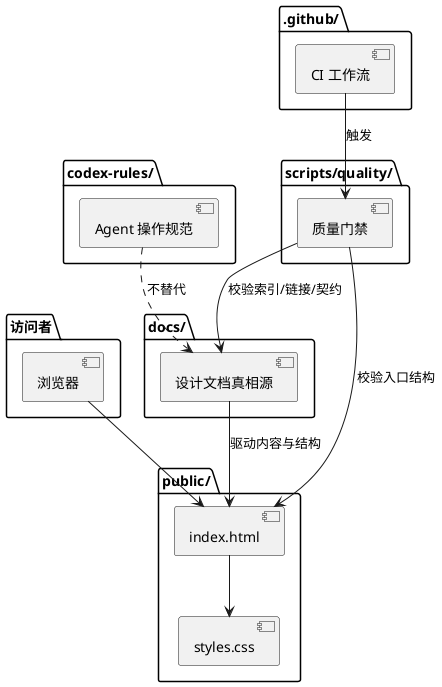
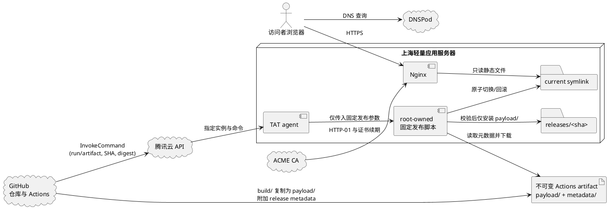

# 架构概览

状态：active  
最近更新：2026-07-18
适用范围：M0 静态网站、工程规范与生产发布基线

## 目标架构更新

用户已确认主站使用 Git + Docusaurus 静态构建，并采用“静态主站 + 中央身份服务 + 独立评论服务 + 各项目独立服务”的演进方向。D-053 至 D-077 已固定单一 docs 内容实例、领域内容单一真相源、Docusaurus `3.10.2`、Node 24、严格 TypeScript、npm 冻结安装、目标源码边界和首次供应链准入协议。D-078 进一步把不改变产品方向、数据边界或基础设施授权的 M0 内部工程与展示细节委托给 Agent 查证、落盘并验证；E-001 至 E-005 已固定项目结构化事实与长文职责拆分、URL 与路由闭包、内容注册表、classic/Infima 最小主题适配，以及 GitHub Actions 把 `build/` 复制到 artifact 的 `payload/`、附加 `metadata/` 后交由 TAT 受限发布的边界。完整约束见[主站目标架构](main-site-target-architecture.md)和[待决策问题](open-decisions.md)。

本文其余部分记录当前仓库实现和 2026-07-13 形成的 M0 生产基线。凡涉及手工维护 `public/index.html`、零框架或推迟静态站点生成器的内容，均已被 D-028、D-029、D-051 先后替代；在 Docusaurus 迁移完成前，它们只描述当前状态，不代表目标实现。

## 目标

AxialMuseWebsite 的首版目标是建立一个可维护的个人技术分享网站，为每个可体验项目提供独立子域名入口，并提前保留向产品服务、技术文章和讨论入口演进的结构空间。

## 架构决策摘要

| 决策域 | M0 选择 | 设计依据 |
|---|---|---|
| 页面技术 | 当前为手写静态骨架；目标为 Node 24 LTS + 严格 TypeScript + Docusaurus `3.10.2` 单一 docs 内容实例静态构建 | classic/Infima 最小适配；首页与列表页使用严格 TypeScript 页面，项目与文章详情由 docs 实例承载；项目/文章双侧栏遵守 E-004 的三档响应式契约，不引入 UI 库、搜索或文章专属交互 |
| 内容事实 | Git 审核；`projects.json` 拥有项目结构化事实，`site-content/projects/` 拥有项目长文，`site-content/writing/` 拥有技术文章 | E-001/E-003 固定作者、主题和项目写作模块注册表及其引用；构建期只读投影框架字段，构建产物不成为编辑源 |
| URL 与发现 | 根 `routeBasePath`，文章原生完整 `slug`，项目短 slug；canonical 统一使用末尾 `/` | E-002 失败关闭检查重复路由、断链、锚点和精确重定向；M0 不生成系列、主题、作者、归档、筛选、分页、RSS 或独立 `/about/` 路由 |
| 当前质量运行时 | Node.js 22 ESM；目标为 `.nvmrc` 精确 Node `24.18.0` 与 `>=24.16.0 <25` 兼容入口 | 目标版本、随附 npm、唯一 lockfile、严格 TypeScript 和双端点门禁已确定；版本文件、依赖、配置、策略脚本和 CI 接线尚未实施，首次联网解析与真实传递图准入仍受 D-077 门禁 |
| 图表 | 现有 PlantUML 源码编译为静态 SVG | 保留构建期图表流程，不增加浏览器端渲染或 Docusaurus 运行时插件 |
| 质量与供应链 | D-053、D-074、D-077 固定能力类别、独立 `tsc --noEmit`/Docusaurus build 和 npm 原生失败关闭准入 | 策略接口、记录、派生制品、边界检查和 CI 编排由 D-078 授权的编码 Spec 实施；当前尚未覆盖目标依赖图、lockfile、SBOM/NOTICE、审计和静态制品 |
| 生产服务 | Ubuntu 24.04 LTS + Nginx + Certbot（ACME HTTP-01）+ systemd/logrotate | 直接提供静态产物和原生运维，不运行主站应用后端或数据库 |
| 发布 | GitHub Actions 将 `build/` 封装为不可变 `payload/` + `metadata/` artifact -> CAM -> TAT 固定命令 -> 原子 release | artifact 绑定 `main` 精确 SHA、外部 digest、内部 release metadata 与逐文件 SHA-256 清单；服务器只安装 `payload/`，不安装 Node、不拉源码、不执行仓库脚本 |
| 数据与隐私 | 无应用数据层、无 Cookie、无第三方运行时请求 | M0 没有已确认的数据收集需求 |

当前有效的选择、取舍和实施门禁见[主站目标架构](main-site-target-architecture.md)。[M0 主站实现 Spec](../product/m0-main-site-spec.md)已按 D-078 与 E-001 至 E-005 收敛为 Docusaurus 多页面实现基线；内部实现细节不再逐项请求用户选择，D-078 排除的联网依赖准入、基础设施、公开事实、数据与未来动态能力仍执行原门禁。

## 当前实现

当前没有运行时后端、数据库、登录、评论系统或用户数据采集。

## 目标生产架构

首版生产环境采用 GitHub + 腾讯云 DNSPod + 腾讯云轻量应用服务器：

| 层级 | 组件 | 职责 |
|---|---|---|
| 源码与审核 | GitHub | Git 历史、PR、分支保护、Actions 质量门禁和 deployment 记录 |
| 本地预览 | 现有 Linux 预览机 | feature / `dev` 分支渲染与桌面/移动验收 |
| 域名解析 | 腾讯云 DNSPod | `axialmuse.com` 权威解析和 DNSSEC |
| 生产执行 | GitHub Actions + 腾讯云 TAT | 对 `main` 精确提交构建不可变 artifact，并以固定参数触发受限的原子发布 |
| Web 服务 | 腾讯云轻量应用服务器 + Nginx | HTTPS、重定向、安全头和静态资源 |
| 公开站点 | 当前为 `public/` 骨架；目标为从 Docusaurus 默认 `build/` 逐文件复制得到的 artifact `payload/` | `metadata/` 只服务发布校验，不进入 Web Root；生产服务器只校验、解包和静态提供 `payload/` |
| 项目体验 | `<project-slug>.axialmuse.com` | 已登记项目的独立静态体验、证书、发布和回滚边界 |

主站生产发布必须来自 `main` 的精确提交，其他分支只在现有局域网环境预览。项目体验由各自仓库发布到独立子域名，主站只维护入口与注册表。完整子域名边界见 [项目体验子域名架构](project-experience-hosting.md)，服务器、DNS、备案、上线与回滚设计见 [域名与生产发布设计](../operations/domain-deployment.md)，运行责任见 [自动化维护与运行手册](../operations/maintenance.md)。

## 数据与请求流

### 设计到发布

1. 项目结构化事实写入 `docs/contracts/projects.json`，项目长文写入 `site-content/projects/<project-id>/index.md|index.mdx`；技术文章写入 `site-content/writing/<source-name>/index.md|index.mdx`，作者、主题和模块引用分别受 E-003 注册表约束。
2. 实现者在 `dev` 或 feature 分支修改目标 Docusaurus 源码、内容与契约；迁移完成前的 `public/` 只描述当前可见骨架，不参与目标内容双写。
3. 本地与 CI 校验内容模型、路由、链接、资源、Secret、依赖、类型、测试和静态制品。
4. 真实浏览器按 E-004 完成桌面、平板、移动端和键盘验收，证据随 PR 评审。
5. `dev` 集成验证通过后创建 `dev -> main` PR；合入 `main` 后，GitHub Actions 对精确 `GITHUB_SHA` 冻结安装并生成默认 `build/`。
6. Actions 校验制品后，由封装器在临时 `dist/release/` 中把 `build/` 逐文件复制为 `payload/`，并生成 `metadata/release.json` 与按路径稳定排序的 `metadata/files.sha256`；只上传该目录为不可变 artifact，并记录 artifact digest。
7. GitHub Actions 通过最小权限 CAM 调用固定 TAT command，只传 workflow run/artifact 标识、提交 SHA 和预期摘要。
8. 服务器依次验证 GitHub artifact 元数据与 digest、内部 `metadata/release.json`、`metadata/files.sha256`、提交 SHA 和归档路径安全，只把已验证 `payload/` 安装到 `releases/<sha>`；`metadata/` 不进入 Web Root，本机冒烟通过才原子切换 `current`，失败则保持或恢复上一版本。
9. GitHub runner 完成公网 HTTPS、canonical、关键页面与资源冒烟，并保留 deployment 记录。

当前 `public/` 仍是迁移前事实。目标生产链只接收 CODE-015 定义的 `payload/` + `metadata/` Actions artifact；生产服务器只安装已验证 `payload/`，不拉取源码、不运行 Node/npm 或仓库脚本，也不成为内容编辑或构建源。

### 浏览器请求

1. DNSPod 将 `www.axialmuse.com` 解析到轻量服务器。
2. Nginx 终止 TLS，校验精确 Host，并从 `/srv/axialmuse/current` 读取静态文件。
3. 当前骨架加载本地 HTML、CSS 和图片；目标 `build/` 加载 Docusaurus 标准 React 客户端资源和仓库内静态资产。未经批准时，页面不请求站点 API、第三方字体、分析或嵌入脚本。
4. 用户主动点击 GitHub 或备案链接时才离开本站。

### 信任边界

- **公开边界**：当前 `public/` 和未来 Docusaurus 静态制品中的 HTML、CSS、JavaScript、图片、视频、字幕和元数据均可被任何人下载，不能包含秘密或私人资料。
- **仓库边界**：GitHub 保存源码、公开文档、CI 记录和绑定精确 SHA 的不可变 `payload/` + `metadata/` artifact；GitHub secrets 只进入受控 workflow，不写入 release。
- **云控制面边界**：腾讯云保存 DNS、CAM、TAT、实例和证书运行状态；控制台不是内容真相源。
- **服务器边界**：Nginx 只读由 artifact `payload/` 安装的 release；发布脚本校验 `metadata/` 但不把它安装到 Web Root，也不拉取源码或运行构建；发布脚本和证书由受限系统身份管理，网页内容不能写服务器磁盘。

## 故障隔离

- 页面内容或 CSS 错误通过切换 `current` 回滚，不修改 DNS 或重装服务器。
- Nginx 或证书错误先回滚对应配置，不重新发布页面内容。
- 主站与项目体验使用独立目录、证书和发布命令；一个体验失败不能切换主站 release。
- DocRestore 当前不创建 DNS、Nginx 或证书，因此其私有后端不会进入主站生产故障域。
- GitHub Actions、TAT 或公网检查失败时不得把未验证 release 标记为成功。
- artifact 的提交、外部 digest、内部 metadata、`payload/` 文件清单或归档路径校验失败时不得创建或切换 release。

## 目录职责

- `public/`：迁移前静态网站入口和资源；不是 Docusaurus 目标源码或已确认的目标产物目录。
- `build/`：Docusaurus 默认静态输出；是封装器的只读输入，不是 Actions artifact 根、编辑源或 `src/build/`。
- `dist/release/payload/` 与 `dist/release/metadata/`：CODE-015 的临时 artifact 封装；前者逐文件复制 `build/`，后者保存 release 身份与文件摘要。`dist/` 不提交，服务器只安装 `payload/`。
- 根 `docusaurus.config.ts` 与 `sidebars.ts`：D-075 已确认的框架入口；承载 E-002 路由和 E-004 docs/主题接线，当前尚未创建。
- `site-content/projects/<project-id>/`：E-001 的项目长文正文；项目结构化事实继续由 `docs/contracts/projects.json` 拥有。
- `site-content/writing/<source-name>/`：D-060 至 D-064 的技术文章源码与文章局部 `assets/`。
- `src/domain/` 与 `src/build/`：领域核心与构建期适配源码；`src/build/` 是源码目录，不是静态构建产物目录，当前均尚未创建。
- `src/components/`、`src/pages/` 与 `src/theme/`：通用展示组件、E-004 文件路由页面与最小主题适配；当前均尚未创建。
- `scripts/author/`：作者显式 Node.js 工具目录；具体接口由 D-078 授权的编码 Spec 固定，当前尚未创建。
- `docs/`：定位、架构、内容模型、产品服务演进和契约词表的真相源。
- `docs/contracts/projects.json`：项目结构化事实、导航顺序和项目写作模块的唯一注册表。
- `docs/contracts/authors.json` 与 `docs/contracts/topics.json`：E-003 的作者和主题注册表。
- `docs/contracts/redirects.json`：E-002 的精确同站永久重定向登记，不接收通配规则。
- `docs/contracts/project-experiences.json`：已规划、上线、暂停和退役项目体验的公开事实注册表。
- `codex-rules/`：Codex 执行任务时的操作规范。
- `scripts/quality/`：CI 和本地质量门禁。
- `.github/`：PR 模板、CODEOWNERS、CI，以及 E-005 的 `build/` artifact 构建与受限发布编排。
- 腾讯云（仓库外）：域名注册、DNS、轻量应用服务器、TAT 和账号控制面，非内容真相源。

## 演进原则

- 扩展框架能力或新增依赖前先明确其解决的问题，并按 D-052/D-077 完成相应准入。
- 引入用户交互前先明确隐私边界、滥用风险、数据保留和删除策略。
- 产品服务上线前先明确服务边界，不用营销文案替代真实能力说明。
- 项目体验必须先登记、隔离和验证，再配置主站入口；不能用泛解析替代项目治理。
- 域名、Git 仓库和静态产物必须保持可迁移，供应商后台不能成为唯一内容来源。

## 架构验收

- 当前 `public/` 是迁移前静态骨架；目标 release 来自 GitHub Actions 对 `main` 精确 SHA 生成的 `payload/` + `metadata/` artifact，其中 `payload/` 是 Docusaurus 默认 `build/` 的逐文件复制。服务器校验两层摘要后只安装 `payload/` 并交给 Nginx 静态提供，生产请求不依赖 Node.js、数据库或第三方 API。
- D-078/E-001 至 E-005 已关闭项目内容职责、路由闭包、注册表、主题响应式、输出目录和制品交付的逐项用户决策；剩余内部 API、命名、路径检查、测试和 CI 接线由编码 Spec 实施并验证，不再重新选择上层方向。
- 首次候选 lockfile 联网解析、真实传递图最终准入、安装、Action 与凭证配置、服务器和云资源操作仍受各自门禁；当前 Node 22、缺失的目标配置和现有 workflow 不能表述为目标能力已经部署。
- 项目列表、项目侧栏和项目详情元数据从 `projects.json` 同一结构化事实投影；项目长文、文章、作者、主题、模块和重定向没有并行可编辑副本。
- 从 contract 变更到页面、门禁、PR、`main` SHA、TAT invocation 和 release 的链路可追溯。
- DNS、TLS、Nginx、发布和页面内容可以分别验证和回滚。
- 浏览器、GitHub、腾讯云控制面和服务器四个信任边界没有共享网页可读取的凭证。
- 未登记或未批准的项目不会因泛解析、默认 Nginx Host 或页面占位链接意外公开。
