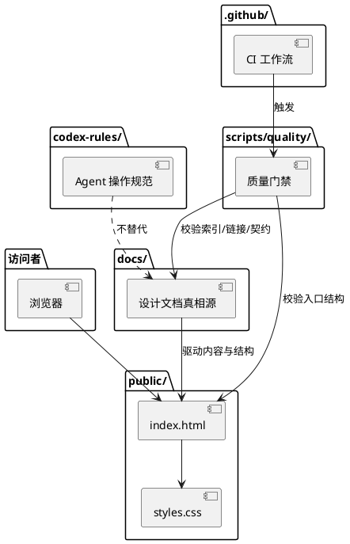

# 架构概览

状态：active  
最近更新：2026-07-13
适用范围：M0 静态网站、工程规范与生产发布基线

## 目标

AxialMuseWebsite 的首版目标是建立一个可维护的个人技术分享网站，为每个可体验项目提供独立子域名入口，并提前保留向产品服务、技术文章和讨论入口演进的结构空间。

## 当前实现

当前没有运行时后端、数据库、登录、评论系统或用户数据采集。

## 目标生产架构

首版生产环境采用 GitHub + 腾讯云 DNSPod + 腾讯云轻量应用服务器：

| 层级 | 组件 | 职责 |
|---|---|---|
| 源码与审核 | GitHub | Git 历史、PR、分支保护、Actions 质量门禁和 deployment 记录 |
| 本地预览 | 现有 Linux 预览机 | feature / `dev` 分支渲染与桌面/移动验收 |
| 域名解析 | 腾讯云 DNSPod | `axialmuse.com` 权威解析和 DNSSEC |
| 生产执行 | GitHub Actions + 腾讯云 TAT | 对 `main` 精确提交触发受限的原子发布 |
| Web 服务 | 腾讯云轻量应用服务器 + Nginx | HTTPS、重定向、安全头和静态资源 |
| 公开站点 | `public/` | 零依赖静态文件，不包含运行时后端或数据库 |
| 项目体验 | `<project-slug>.axialmuse.com` | 已登记项目的独立静态体验、证书、发布和回滚边界 |

主站生产发布必须来自 `main` 的精确提交，其他分支只在现有局域网环境预览。项目体验由各自仓库发布到独立子域名，主站只维护入口与注册表。完整子域名边界见 [项目体验子域名架构](project-experience-hosting.md)，服务器、DNS、备案、上线与回滚设计见 [域名与生产发布设计](../operations/domain-deployment.md)，运行责任见 [自动化维护与运行手册](../operations/maintenance.md)。

## 目录职责

- `public/`：首版静态网站入口和资源。
- `docs/`：定位、架构、内容模型、产品服务演进和契约词表的真相源。
- `docs/contracts/project-experiences.json`：已规划、上线、暂停和退役项目体验的公开事实注册表。
- `codex-rules/`：Codex 执行任务时的操作规范。
- `scripts/quality/`：CI 和本地质量门禁。
- `.github/`：PR 模板、CODEOWNERS 和 CI。
- 腾讯云（仓库外）：域名注册、DNS、轻量应用服务器、TAT 和账号控制面，非内容真相源。

## 演进原则

- 引入框架前先明确框架解决的问题，例如内容规模、路由、构建、SEO、MDX、搜索或部署需求。
- 引入用户交互前先明确隐私边界、滥用风险、数据保留和删除策略。
- 产品服务上线前先明确服务边界，不用营销文案替代真实能力说明。
- 项目体验必须先登记、隔离和验证，再配置主站入口；不能用泛解析替代项目治理。
- 域名、Git 仓库和静态产物必须保持可迁移，供应商后台不能成为唯一内容来源。
