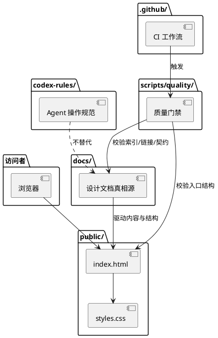
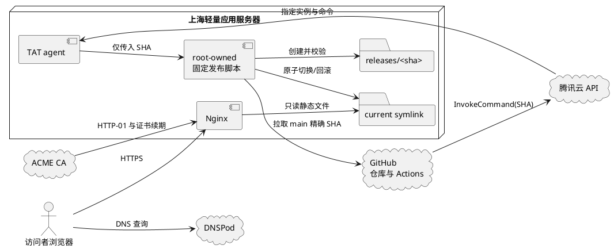

# 架构概览

状态：active  
最近更新：2026-07-13
适用范围：M0 静态网站、工程规范与生产发布基线

## 目标

AxialMuseWebsite 的首版目标是建立一个可维护的个人技术分享网站，为每个可体验项目提供独立子域名入口，并提前保留向产品服务、技术文章和讨论入口演进的结构空间。

## 架构决策摘要

| 决策域 | M0 选择 | 设计依据 |
|---|---|---|
| 页面技术 | 语义化 HTML5 + 原生 CSS，无运行时 JavaScript | 单页、无客户端状态，以最低维护成本提供可访问内容 |
| 内容事实 | `docs/contracts/projects.json` + Git 审核 | 公开项目事实可追溯，页面映射由质量门禁约束 |
| 质量运行时 | Node.js 22 ESM | 使用现有零第三方依赖检查，不进入生产请求链路 |
| 生产服务 | Ubuntu 24.04 LTS + Nginx + ACME | 直接提供静态产物，职责和故障边界清楚 |
| 发布 | GitHub Actions -> CAM -> TAT 固定命令 | 只发布 `main` 精确 SHA，不向自动化开放任意 SSH 命令 |
| 数据与隐私 | 无应用数据层、无 Cookie、无第三方运行时请求 | M0 没有已确认的数据收集需求 |

候选方案、取舍、已接受限制和重新选型条件见[M0 技术选型决策](technology-selection.md)。页面实现不得从本概览反推视觉和内容细节，具体要求以[M0 主站实现 Spec](../product/m0-main-site-spec.md)为准。

## 当前实现

当前没有运行时后端、数据库、登录、评论系统或用户数据采集。

## 目标生产架构

首版生产环境采用 GitHub + 腾讯云 DNSPod + 腾讯云轻量应用服务器：

| 层级 | 组件 | 职责 |
|---|---|---|
| 源码与审核 | GitHub | Git 历史、PR、分支保护、Actions 质量门禁和 deployment 记录 |
| 本地预览 | 现有 Linux 预览机 | feature / `dev` 分支渲染与桌面/移动验收 |
| 域名解析 | 腾讯云 DNSPod | `axialmuse.com` 权威解析和 DNSSEC |
| 生产执行 | GitHub Actions + 腾讯云 TAT | 对 `main` 精确提交触发受限的原子发布 |
| Web 服务 | 腾讯云轻量应用服务器 + Nginx | HTTPS、重定向、安全头和静态资源 |
| 公开站点 | `public/` | 零依赖静态文件，不包含运行时后端或数据库 |
| 项目体验 | `<project-slug>.axialmuse.com` | 已登记项目的独立静态体验、证书、发布和回滚边界 |

主站生产发布必须来自 `main` 的精确提交，其他分支只在现有局域网环境预览。项目体验由各自仓库发布到独立子域名，主站只维护入口与注册表。完整子域名边界见 [项目体验子域名架构](project-experience-hosting.md)，服务器、DNS、备案、上线与回滚设计见 [域名与生产发布设计](../operations/domain-deployment.md)，运行责任见 [自动化维护与运行手册](../operations/maintenance.md)。

## 数据与请求流

### 设计到发布

1. 公开项目事实先写入 `docs/contracts/projects.json`，定位和页面规则写入 `docs/`。
2. 实现者在 `dev` 或 feature 分支更新 `public/`，并同步站点检查契约。
3. 本地与 CI 校验 Markdown、项目契约、密钥形态、静态资源和关键页面事实。
4. 真实浏览器完成桌面、平板、移动端和键盘验收，证据随 PR 评审。
5. `dev` 集成验证通过后创建 `dev -> main` PR；合入 `main` 后，GitHub Actions 只把精确 SHA 交给固定 TAT 发布命令。
6. 服务器创建不可变 release，验证后原子切换 `current`；失败则保持或恢复上一版本。

`docs/` 和 contract 不是生产运行依赖；生产请求只读取已经审核的 `public/` 静态文件。服务器不在发布时生成页面，也不成为内容编辑源。

### 浏览器请求

1. DNSPod 将 `www.axialmuse.com` 解析到轻量服务器。
2. Nginx 终止 TLS，校验精确 Host，并从 `/srv/axialmuse/current` 读取静态文件。
3. 浏览器加载本地 HTML、CSS 和图片；页面不请求站点 API、第三方字体、分析或嵌入脚本。
4. 用户主动点击 GitHub 或备案链接时才离开本站。

### 信任边界

- **公开边界**：`public/` 中的 HTML、CSS、图片、视频、字幕和元数据可被任何人下载，不能包含秘密或私人资料。
- **仓库边界**：GitHub 保存源码、公开文档和 CI 记录；GitHub secrets 只进入受控 workflow，不写入 release。
- **云控制面边界**：腾讯云保存 DNS、CAM、TAT、实例和证书运行状态；控制台不是内容真相源。
- **服务器边界**：Nginx 只读 release；发布脚本和证书由受限系统身份管理，网页内容不能写服务器磁盘。

## 故障隔离

- 页面内容或 CSS 错误通过切换 `current` 回滚，不修改 DNS 或重装服务器。
- Nginx 或证书错误先回滚对应配置，不重新发布页面内容。
- 主站与项目体验使用独立目录、证书和发布命令；一个体验失败不能切换主站 release。
- DocRestore 当前不创建 DNS、Nginx 或证书，因此其私有后端不会进入主站生产故障域。
- GitHub Actions、TAT 或公网检查失败时不得把未验证 release 标记为成功。

## 目录职责

- `public/`：首版静态网站入口和资源。
- `docs/`：定位、架构、内容模型、产品服务演进和契约词表的真相源。
- `docs/contracts/project-experiences.json`：已规划、上线、暂停和退役项目体验的公开事实注册表。
- `codex-rules/`：Codex 执行任务时的操作规范。
- `scripts/quality/`：CI 和本地质量门禁。
- `.github/`：PR 模板、CODEOWNERS 和 CI。
- 腾讯云（仓库外）：域名注册、DNS、轻量应用服务器、TAT 和账号控制面，非内容真相源。

## 演进原则

- 引入框架前先明确框架解决的问题，例如内容规模、路由、构建、SEO、MDX、搜索或部署需求。
- 引入用户交互前先明确隐私边界、滥用风险、数据保留和删除策略。
- 产品服务上线前先明确服务边界，不用营销文案替代真实能力说明。
- 项目体验必须先登记、隔离和验证，再配置主站入口；不能用泛解析替代项目治理。
- 域名、Git 仓库和静态产物必须保持可迁移，供应商后台不能成为唯一内容来源。

## 架构验收

- `public/` 是完整静态产物，生产请求不依赖 Node.js、数据库或第三方 API。
- 从 contract 变更到页面、门禁、PR、`main` SHA、TAT invocation 和 release 的链路可追溯。
- DNS、TLS、Nginx、发布和页面内容可以分别验证和回滚。
- 浏览器、GitHub、腾讯云控制面和服务器四个信任边界没有共享网页可读取的凭证。
- 未登记或未批准的项目不会因泛解析、默认 Nginx Host 或页面占位链接意外公开。
