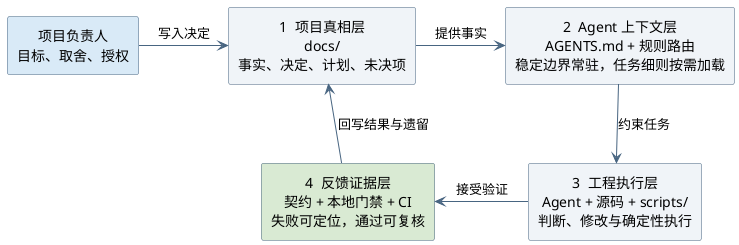
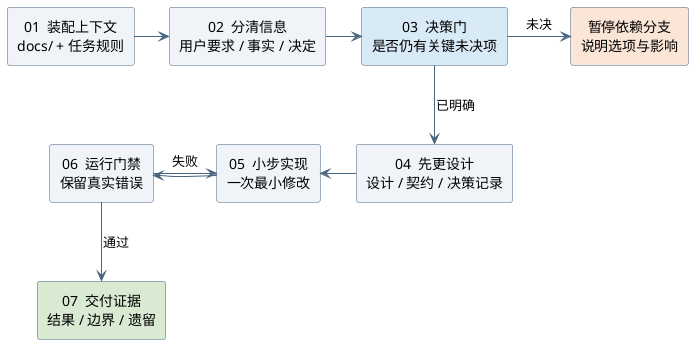
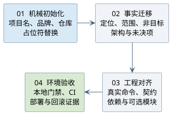
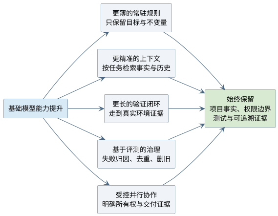

# AI 编码脚手架文章图表源

本文档维护技术文章
[`ai-coding-scaffold-engineering-loop`](../../site-content/writing/ai-coding-scaffold-engineering-loop/index.md)
的 PlantUML 真相源。每段源码必须紧跟目标 SVG；`npm run check:diagrams`
负责真实编译，设置 `PUML_JAR` 后运行 `npm run gen:diagrams` 可刷新目标文件。

文章正文只引用 SVG，不重复展示 PlantUML 源码。这样公开阅读优先呈现图表，
仓库仍保留可审查、可编译、可再生成的源文件。

## 四层工程控制面

## 单次任务闭环

## 脚手架迁移

## 脚手架演进

