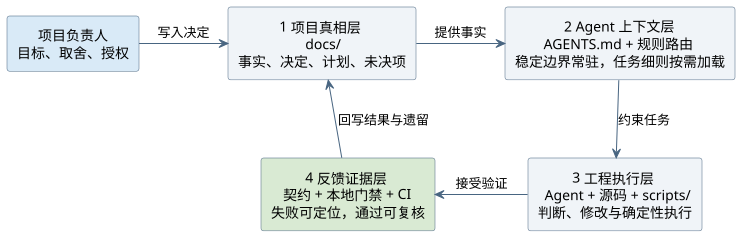
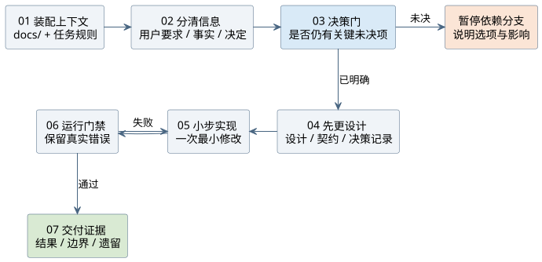
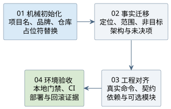
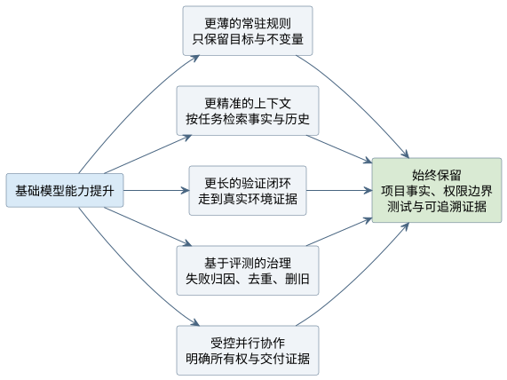

AI 编码真正困难的部分，正在从“能不能生成代码”转向“能不能理解项目、遵守边界，并为修改提供可信证据”。[VibeCoding Project Scaffold](../../projects/vibecoding-project-scaffold/index.md) 就是围绕这个问题建立的项目。

这篇技术分享就是该项目的设计、实现与复盘记录，不是脱离项目的通用方法论。项目用文档保存事实，用分层规则装配 Agent 上下文，用确定性脚本完成机械工作，再让本地门禁和 CI 形成反馈闭环。它更像 AI 与项目之间的一层工程控制面，而不是一份更长的提示词。

> 本文的工程事实固定核对
> [`project-scaffold@a9f6cd51c843f417858ae0417191523d0df11d84`](https://github.com/lyty1997/project-scaffold/tree/a9f6cd51c843f417858ae0417191523d0df11d84)。
> 后续提交不会自动改写本文结论。

## 问题背景

刚开始使用 AI 编码时，我主要关心需求能否描述清楚、生成的函数能否运行。随着项目逐渐变长，真正反复消耗时间的却变成了另外几件事：

- 模型不知道这个项目为什么这样设计；
- 同一个约定散落在聊天、文档和代码里，过一段时间便互相矛盾；
- 一次修改完成了，却没有证明文档、实现、测试和 CI 仍然一致；
- 新项目启动时，又要重新解释目录、命名、安全边界和交付标准。

问题不再是单次回答够不够聪明，而是项目能否为下一次任务保留可靠上下文。

因此，我把目标从“提高一次代码生成的质量”调整为：**让每次编码都进入可追溯、可验证、可复用的工程闭环。**

## 约束与非目标

这套脚手架有四条明确边界：

- **技术栈中立**：不预设 React、Vue、Python、C++、数据库或部署平台；
- **不替人做产品决定**：Agent 可以查事实、分析选项，但定位、数据、费用、部署和公开表达仍由项目负责人决定；
- **不把自动化等同于自治**：需要凭证、浏览器授权或生产写操作时，流程必须停在授权门；
- **只陈述可验证能力**：本地实现、远端验收和未来计划必须分开表达。

截至上述提交，仓库仍是一份尚未初始化的通用模板：

| 范围 | 当前事实 |
| --- | --- |
| 初始化 | 已提供 `npm run init` 与 `node scripts/init.mjs` |
| 基础质量 | `npm run quality` 使用 Node.js 内置能力，不要求第三方 npm 运行依赖 |
| Agent 上下文 | 已提供 `AGENTS.md`、`codex-rules/`、`.claude/` 和规则路由 |
| CI/CD | 探测、决策台账、渲染与本地门禁已经实现；真实绿地项目的远端闭环仍待验收 |
| 测试 | `npm test` 仍是占位命令，具体项目必须按真实技术栈补齐 |
| 在线服务 | 不提供在线生成器，不接收用户输入 |

这些限制不是免责声明，而是文章结论成立的范围。

## 方案选择

### 不写一份更长的提示词

长提示词能改善一次会话，却很难独自承担长期项目的上下文管理：

| 一次性提示词 | 仓库工程控制面 |
| --- | --- |
| 主要影响当前会话 | 随 Git 版本化，可被后续会话复用 |
| 能描述“应该怎么做” | 脚本和门禁可以证明是否做到 |
| 容易与代码状态分离 | 事实、执行入口和验证证据能互相追溯 |
| 上下文通常整体输入 | 稳定规则常驻，场景规则按任务加载 |

我的选择是把对话里的高价值信息拆成四层仓库资产，让它们形成一条从事实到证据的依赖链。



_图 1：项目决定进入工程执行，验证证据再回写真相层。_

### 第一层：项目真相

`docs/` 不再是实现结束后补写的说明书，而是定位、架构、产品边界和部署决定的真相源。内容需要区分：

- **事实**：仓库、脚本或权威来源已经能证明；
- **决定**：项目负责人明确选定；
- **计划**：未来想做，但尚未交付；
- **未决项**：只能由负责人取舍，Agent 不应代猜。

这能避免把“计划接入评论”改写成“已经支持评论”，也能防止临时偏好被自动升级为架构决定。

### 第二层：Agent 上下文

根目录 `AGENTS.md` 只保留跨任务成立的边界。更细的规则通过索引按任务加载：写 Markdown 才读取文档规则，修改 CI/CD 才读取流水线规则，触及隐私时再加载安全约束。

目标不是堆更多规则，而是让**稳定规则常驻、场景规则按需进入上下文**。

### 第三层：工程执行

模型擅长理解目标、分析取舍和生成方案；批量替换占位符、扫描文件、渲染配置和检查路径则更适合确定性脚本。

因此，初始化器、质量脚本、预览脚本和 CI/CD 探测器都进入仓库。Agent 判断何时调用，脚本返回稳定结果，两者各自承担更擅长的部分。

### 第四层：反馈证据

仅在文档里写“不要泄漏密钥”“内部链接不要断”约束力有限。能够稳定判断的高价值规则应该继续下沉为检查，例如：

- Markdown 链接和文档索引；
- 品牌名、状态枚举和禁用旧名；
- 常见密钥形态；
- 静态站点入口与相对资源；
- PlantUML 真实编译；
- workflow 安全红线与 actionlint 语义检查。

于是 Agent 返回的不只是“改好了”，而是可定位的失败，或可随结果交付的通过证据。

## 实现或实验

### 仓库按职责分层

脚手架不按某个业务框架划分，而是按事实、规则、自动化和证据组织：

```text
project/
├── AGENTS.md                  # 所有 Agent 始终遵守的边界
├── CLAUDE.md                  # Claude Code 的共享规则入口
├── docs/
│   ├── README.md              # 文档索引
│   ├── architecture/          # 架构、工作流与未决项
│   ├── contracts/             # 机器可读契约和决策台账
│   └── progress.md            # 完成证据与遗留项
├── codex-rules/               # Codex 按任务选读的规则
├── .claude/                   # Claude Code 规则、hooks 与 skills
├── scripts/
│   ├── init.mjs               # 初始化与占位符替换
│   ├── quality/               # 零第三方依赖的基础门禁
│   ├── dev/                   # 可选同步与跨机预览
│   └── cicd/                  # CI/CD 探测与台账驱动渲染
├── .githooks/                 # 提交前与提交信息门禁
├── .github/workflows/         # 远端 CI
└── package.json               # 命令的实现真相源
```

这里有三个关键取舍：

1. 每类事实只有一个正文所有者，上层文档只做索引，不复制下层结论；
2. 项目相关决定保存在 JSON 台账中，workflow 等文件由渲染器单向生成；
3. 本地和远端尽量调用同一条质量基线，专项外部工具再放进独立 CI job。

### 一次任务怎样闭环

目录解决信息放在哪里，任务流程决定信息如何参与一次真实修改。



_图 2：决策门在实现前分流未决项，门禁失败回到最小实现。_

这个流程的核心是实现之前的决策门：仓库里没有数据库是事实，项目是否需要数据库是决定，以后可能增加账号体系是计划。模型可以查事实、分析方案，但不能把后两者混成已经确定的实现。

验证失败也不应被“能跑就行”的兜底遮住。对 AI 编码而言，高质量错误本身就是下一轮最有价值的上下文之一。

### 迁移到新项目

复用脚手架不是复制目录后立刻写业务代码，而是先把模板身份迁移成新项目的真实信息，再裁剪没有消费者的能力。



_图 3：复用从机械身份初始化开始，以真实环境验收收尾。_

第一步只处理机械身份：

```bash
npm run init
git config core.hooksPath .githooks
npm run quality
```

接下来还要完成三类工作：

- 让 `docs/` 描述真实目标、使用者、范围、架构和未决项；
- 让契约、formatter、lint、类型、测试和构建命令对齐真实技术栈；
- 根据实际消费者保留或删除跨机预览、数据库迁移、CI/CD 和 Release 等选配能力。

脚手架中的内容可以分成三类：

| 类型 | 处理方式 | 例子 |
| --- | --- | --- |
| 通用机制 | 先保留，再根据真实摩擦精炼 | 真相源、规则路由、决策门、失败不静默放行 |
| 项目事实 | 必须替换 | 定位、品牌词、状态、扫描路径、数据与部署目标 |
| 按需能力 | 先确认是否有消费者 | 跨机预览、数据库迁移、CI/CD、Release |

最危险的不是漏改一个名字，而是把模板事实误当成通用机制。

## 验证结果

本次内容复核以精确提交和原始文件为证据，不用仓库首页文案代替实现：

- `package.json` 中存在初始化、质量、CI/CD 探测与渲染、PlantUML 检查等入口；
- `SCAFFOLD.md` 明确说明初始化、规则分层、质量门禁、Git hooks 和可选跨机预览；
- `.github/workflows/ci.yml` 分别运行双系统基础质量、PlantUML 编译和 actionlint；
- `docs/architecture/cicd-autosetup.md` 明确区分本地实现完成与真实绿地项目远端验收；
- 仓库许可证元数据和 `LICENSE` 对应 Apache License 2.0。

同时保留三个没有闭环的事实：

1. `npm test` 仍是占位命令，不能写成已经具备真实业务测试；
2. CI/CD 探测和渲染器已有本地实现，但尚无真实绿地项目的完整远端验收；
3. 跨机预览、部署和 Release 都依赖目标项目的环境、权限与决策，不能由模板存在推导为开箱即用。

本文没有把源码静态复核伪装成一次新的远端 CI 运行，也不承诺脚手架能让任意项目自动达到生产就绪。

## 复盘

### 基础模型变强后，脚手架应该变薄

模型能力提高并不意味着 `AGENTS.md` 应该继续增长。更强的推理、上下文和工具调用能力，反而让规则可以从“逐步教学”转向“真实目标、不可破坏的边界和可验证证据”。



_图 4：能力提升会改变规则厚度，但不移除事实、权限和证据。_

这条演进路径包含五个方向：

1. 删除已经不再需要的教学式步骤，只保留跨任务不变量；
2. 从整份文档输入转向按任务装配事实、历史和测试；
3. 把闭环延伸到真实环境，但在权限和生产写操作前暂停；
4. 按失败原因治理规则，而不是遇到问题就继续加规则；
5. 使用并行 Agent 时明确任务边界、文件所有权、共享资源和验收证据。

### 从真实问题反向维护

我更倾向于从实际项目里的重复问题维护脚手架：

1. 先判断问题是项目专属，还是多个项目都会遇到；
2. 能由唯一文档讲清楚的，回到真相源；
3. 能稳定机器判断的，再升级成门禁或生成器；
4. 新规则运行一段时间后，检查误报、重复和失效；
5. 已经由脚本保证的教学式规则及时删除。

目标不是让脚手架越来越大，而是让正确的信息保存在正确的位置，并在需要时进入 Agent 上下文。

### 哪些结论可以复用

- 项目事实需要唯一、可追溯的来源；
- 人的决定、可查证事实和未来计划必须分开；
- 确定性工作尽量交给脚本；
- 高价值约束尽量变成可执行门禁；
- 每次任务以验证证据和遗留项收尾。

具体目录、命名、Git 流程、CI 矩阵和部署方式则只适用于当前脚手架基线，迁移时必须重新判断。

我目前对 AI 编码的理解是：**基础模型决定能力上限，项目上下文决定模型是否理解现场，反馈闭环决定结果能否稳定交付。**

搭建脚手架不是为了限制模型，而是让模型能力真正接入项目。

## 参考来源

- [VibeCoding Project Scaffold 源码基线](https://github.com/lyty1997/project-scaffold/tree/a9f6cd51c843f417858ae0417191523d0df11d84)，访问日期：2026-07-29。
- [脚手架使用说明](https://github.com/lyty1997/project-scaffold/blob/a9f6cd51c843f417858ae0417191523d0df11d84/SCAFFOLD.md)，访问日期：2026-07-29。
- [项目级 Agent 规范](https://github.com/lyty1997/project-scaffold/blob/a9f6cd51c843f417858ae0417191523d0df11d84/AGENTS.md)，访问日期：2026-07-29。
- [质量门禁设计](https://github.com/lyty1997/project-scaffold/blob/a9f6cd51c843f417858ae0417191523d0df11d84/docs/architecture/quality-gates.md)，访问日期：2026-07-29。
- [CI/CD 自动搭建设计](https://github.com/lyty1997/project-scaffold/blob/a9f6cd51c843f417858ae0417191523d0df11d84/docs/architecture/cicd-autosetup.md)，访问日期：2026-07-29。
- [当前命令清单](https://github.com/lyty1997/project-scaffold/blob/a9f6cd51c843f417858ae0417191523d0df11d84/package.json)，访问日期：2026-07-29。
- [当前 CI workflow](https://github.com/lyty1997/project-scaffold/blob/a9f6cd51c843f417858ae0417191523d0df11d84/.github/workflows/ci.yml)，访问日期：2026-07-29。
- [VibeCoding Project Scaffold 项目展示](../../projects/vibecoding-project-scaffold/index.md)。
